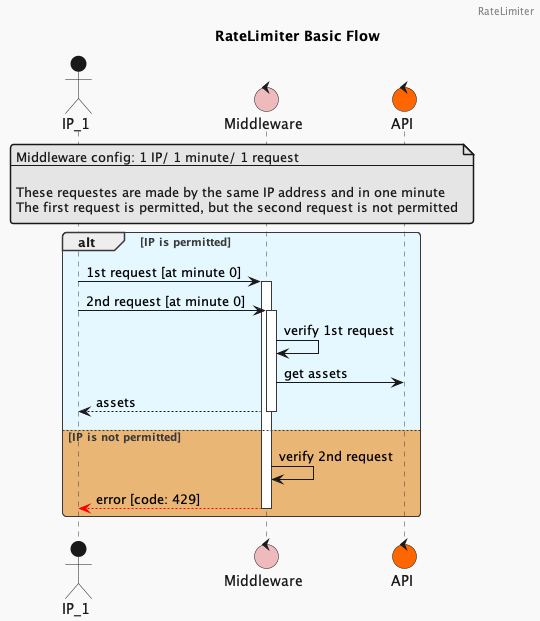

# Gin Rate Limiter Middleware

The `gin-rate-limiter` package provides a simple and flexible rate limiting mechanism for controlling the flow of requests in your Gin web applications. This package offers IP-based rate limiting and can be easily integrated to safeguard your APIs from abuse and overloading.

## Table of Contents

- [Gin Rate Limiter Middleware](#gin-rate-limiter-middleware)
	- [Table of Contents](#table-of-contents)
	- [Overview](#overview)
	- [Installation](#installation)
	- [Usage](#usage)
		- [Creating Rate Limiter Middleware](#creating-rate-limiter-middleware)
		- [Using the Rate Limiter Middleware](#using-the-rate-limiter-middleware)
	- [Supported Rate Limiter Types](#supported-rate-limiter-types)
	- [Examples](#examples)
	- [Contributing](#contributing)
	- [License](#license)

## Overview

The `gin-rate-limiter` package is designed to empower your Gin web applications with rate limiting capabilities. It includes IP-based rate limiting, making it easy to prevent abuse and maintain the stability of your APIs.




## Installation

To install the `gin-rate-limiter` package, use the `go get` command:

```bash
go get github.com/khaaleoo/gin-rate-limiter
```

## Usage
### Creating Rate Limiter Middleware
To create rate limiter instances, use the GetRateLimiterInstance function. Provide the rate limiter type, a key for identifying the instance, and an option struct that defines the rate limiting parameters.

Example:
```go
import (
    "github.com/khaaleoo/gin-rate-limiter"
)

func main() {
	// max of 5 requests and then two more requests per second
	// the rate limiter will reset after 10 second don't receive any requests by the same IP address
	rateLimiterMiddleware := ratelimiter.RequireRateLimiter(ratelimiter.RateLimiter{
		RateLimiterType: ratelimiter.IPRateLimiter,
		Key:             "this_is_a_test_key",
		Option: ratelimiter.RateLimiterOption{
			Limit: 2,
			Burst: 5, // Maximum number of requests allowed to burst
			Len:   10 * time.Second, // Time window
		},
	})
    
    // Use the ipRateLimiter middleware in your application
}
```

### Using the Rate Limiter Middleware
The RequireRateLimiter function provides a Gin middleware that enforces rate limiting on your API routes.

Example:

```go
package example

import (
	"time"

	"github.com/gin-gonic/gin"
	"github.com/khaaleoo/gin-rate-limiter/core"
)

func Example() {
	r := gin.Default()

	// max of 100 requests and then five more requests per second
	// the rate limiter will reset after 1 minute don't receive any requests by the same IP address
	rateLimiterOption := ratelimiter.RateLimiterOption{
		Limit: 5,
		Burst: 100,
		Len:   1 * time.Minute,
	}

	// Create an IP rate limiter instance
	rateLimiterMiddleware := ratelimiter.RequireRateLimiter(ratelimiter.RateLimiter{
		RateLimiterType: ratelimiter.IPRateLimiter,
		Key:             "iplimiter_maximum_requests_for_ip_test",
		Option: rateLimiterOption,
	})

	// Apply rate limiter middleware to a route
	r.GET("/limited-route", rateLimiterMiddleware, func(c *gin.Context) {
		c.String(200, "Hello, rate-limited world!")
	})

	r.Run(":8080")
}
```

## Supported Rate Limiter Types
The gin-rate-limiter package currently supports two rate limiter types:

1. IP Rate Limiter (IPRateLimiter): Limits the number of requests per IP address within a specified time window.
2. JWT Rate Limiter (JWTRateLimiter): This type is not implemented yet.


## Examples
For more usage examples, please refer to the examples directory in the repository.

## Contributing
Contributions to this project are welcome! If you find any issues or want to enhance the package, feel free to submit a pull request.

## License

This project is licensed under the [MIT License](LICENSE).